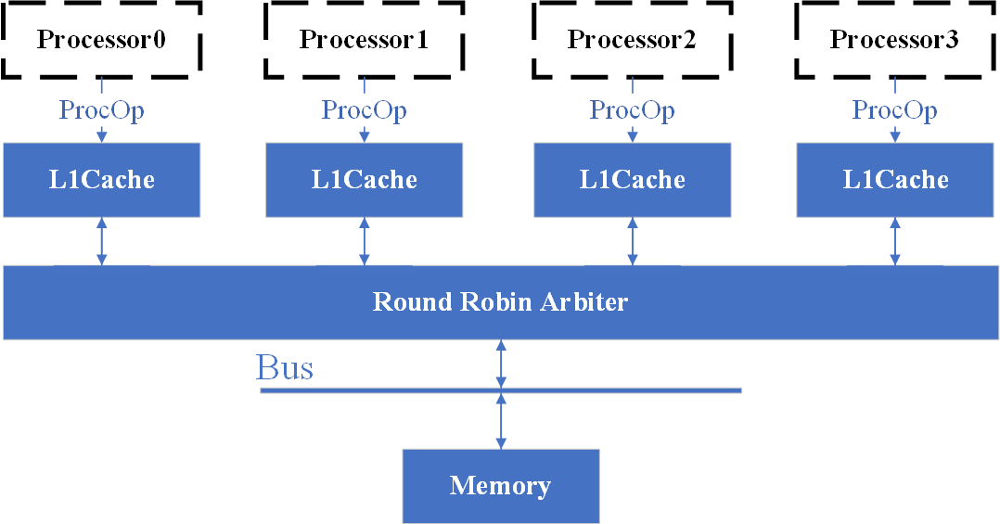
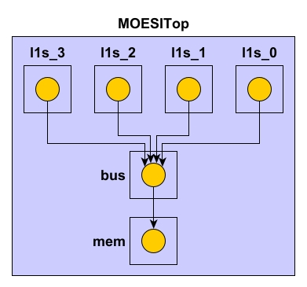

# MOESI Cache Coherance Protocol

## Component Structure

## Parameters

### Bus Operations

- **BusRd**: read request to a cache block requested by another processor.
- **BusRdX**: write request to a cache block requested by another processor that does not have the block.
- **BusUpgrade**: write request to a cache block requested by another processor that has the block.
- **Flush**: Response from another processor to a request.
- **Fill**: memory transfers a block to cache.
- **Invalid**: the bus is currently not carrying valid data.

### Processor Operations

- **PrRd**: processor read request
- **PrWr**: processor write request

### MESI States

- **Modified**: this data is different from memory and is in this cache only.
- **Exclusive**: this data is the same as the memory and is in this cache only.
- **Shared**: this data is the same as the memory and is in multiple caches.
- **Invalidated**: this cache line is invalid.

### MOESI States

- **Modified**: this data is different from memory and is in this cache only.
- **Owned**: this data is different from memory and is in multiple caches.
- **Exclusive**: this data is the same as the memory and is in this cache only.
- **Shared**: this data is the same as the Owned cache and is in multiple caches.
- **Invalidated**: this cache line is invalid.

### Bits and Addresses

This system has **4** processors for now and the address consists of **2+2** bits (**2** bits for **index** and **2** bits for **tag**).
Each cache block has **8** bits and there are **4** blocks in each cache.

## Code Logic

This system is snooping-based. In the L1Cache, each cache also contains a tag directory. 
- First, the cache checks the transaction from the bus, which can be split into several cases depending on whether the address of the bus data hits (`isHit(busTag, busIndex)`). And then the cache updates the status or gives response based on the status of the operations of the bus (`busTrans`).
- Second, the cache processes the operations from the processor, depending on whether the address from the processor hits (`isHit(tag, index)`). Since the bus is shared for all processors, the bus needs arbiter (round robin) to choose a processor to process data. The cache needs to wait until it is time for this cache to process.

### Diplomacy Design

The Diplomacy framework requires the system as a directed acyclic graph. Since the caches and the memory need to communicate with the bus in a mutual way, there must be two paths of Diplomacy nodes.
Each component (caches, bus and the memory) processes the data carried by their nodes and put the output on the corresponding nodes.